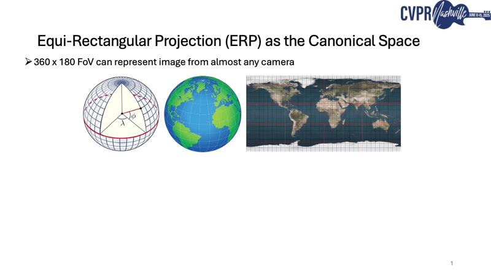

# Depth Any Camera

**Depth Any Camera (DAC)** is a zero-shot metric depth estimation framework that handles any type of camera with varying FoVs.
DAC enables using the existing data with every piece of previously collected 3D data regardless of the camera type used in a new application.
The framework is trained exclusively on *perspective images*, but can be generalized to fisheye and 360 cameras without requiring specialized training data.

## 🧠 How Does it Work?

DAC employs *Equi-Rectangular Projection (ERP)* as a unified image representation, enabling consistent processing of images with diverse FoVs.
Its key components include a pitch-aware *Image-to-ERP* conversion for online augmentation in ERP space, a FoV alignment operation to support effective training across a wide range of FoVs, and multi-resolution data augmentation to address resolution disparities between training and testing.
DAC achieves state-of-the-art zero-shot metric depth estimation compared to prior metric depth foundation models, demonstrating robust generalization across camera types.

## 💡 Applications

This system can used for a wide range of different use cases like robotics, autonomous navigation, segmentation, etc.

## 🚀 Benchmark

You can find the benchmark results of **Depth Any Camera** for depth estimation [here](depth-any-camera.ipynb).

## 📍 Links

- **🌐 Source**: [https://yuliangguo.github.io/depth-any-camera/](Website)
- **🔗 GitHub**: [https://github.com/yuliangguo/depth_any_camera](https://github.com/yuliangguo/depth_any_camera)
- **📄 Paper**: [https://arxiv.org/abs/2501.02464](https://arxiv.org/abs/2501.02464)