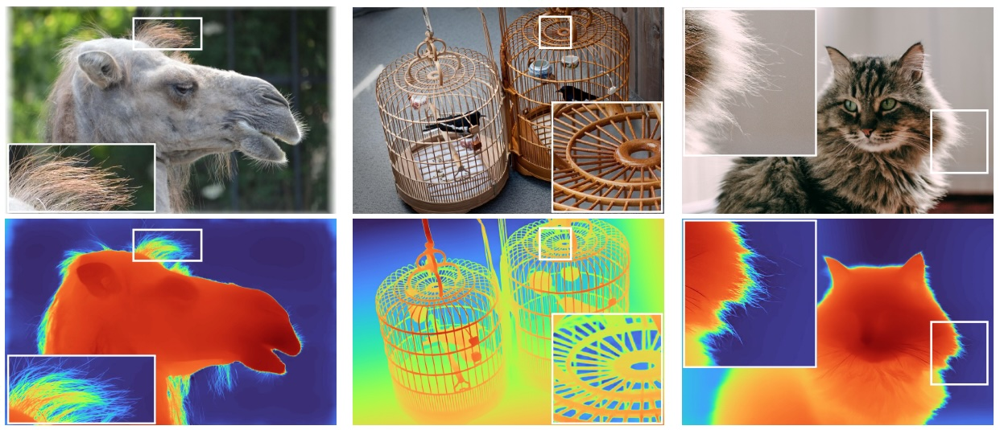

# Depth Pro (Apple AI)

**Depth Pro** is an foundational zero shot metric depth estimation model developed by Apple ML and introduced in 2024 as an open-source system. 
It creates high resolution, sharp monocular metric depth maps in less than a second.
While stereo cameras are the main sources for depth applications, deep learning based monocular depth such as Depth Pro are simpler yet promising alternatives.

## 🧠 How Does it Work?

Infering depth from a single frame and achieving reliable results comparable stereo setups is a highly challenging task.
While semantic segmentation is a pixel-wise *classification* task, a monocular depth estimation is also a pixel-wise *regression* task.
Thus, it assigns values to each pixel of varying intensities to discern the object and the background in absolute or relative scale.
In this regard, **Depth Pro** is an **absolute depth estimator**, meaning that the intensity directly gauges the physical distance (in meters) from the camera sensor to the object point corresponding to that pixel.
Other solutions like **Depth Anything V2** or **Marigold** are relative depth estimators, which are able to distinguish the foreground and background planes, without referring to real-world units of measurement.

According to the paper, it takes 0.3 seconds on a V100 GPU to calcylate the depth of an image.
One of the pros of Depth Pro compared to other SOTA methods is its ability to grasp the depth of very thin structures like hair strands with high precision.
That is because of Depth Pro's efficient **multi-scale vision transformer**-based architecture and the use of a **training protocol** with real and synthetic datasets.
Depth Pro outputs a **Canonical inverse depth** map by default which is preferred for visualization purposes.
Moreover, it has a **Focal Length Estimation Head (FLEH)** where focal length is obtained from the subnetwork of the model which estimates the focal length for an input image.

## 💡 Applications

This system can used for a wide range of different use cases like robotics, autonomous navigation, segmentation, etc.
- Simulating the focal properties of real cameras (sharpening and blurring)
- Depth blur for portrait mode simulation
- 3D point cloud projection

## 🚥 Limitations

Note that while **Depth Pro** provides highly accurate depth maps, it has various limitations, as listed below:
- Blurred subjects, like glasses
- Foggy and cloudy scenes
- Mirror reflections
- Graffiti illusions
- Video input (generates inconsistent and flickering depth throughout frames - Check [DepthCrafter](https://github.com/tencent/depthcrafter) for a video depth estimator)

## 🚀 Benchmark

You can find the benchmark results of **Depth Pro** for depth estimation [here](depth-pro.ipynb).
You can also find some implemented applications by **Depth Pro** [here](depth-pro-applications-ipynb).

## 📍 Links

- **🌐 Source**: [https://learnopencv.com/depth-pro-monocular-metric-depth/](LearnOpenCV)
- **🔗 GitHub**: [https://github.com/apple/ml-depth-pro](https://github.com/apple/ml-depth-pro)
- **📄 Paper**: [https://doi.org/10.48550/arXiv.2410.02073](https://doi.org/10.48550/arXiv.2410.02073)