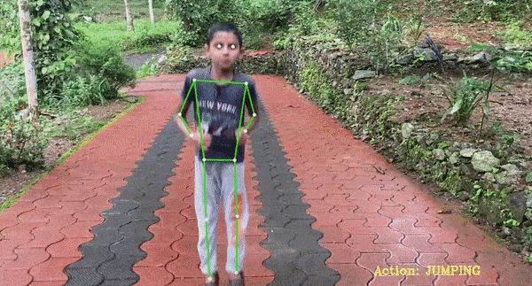

# Detectron2 (for Human Action Recognition)

The task of Human Action Recognition (HAR) involves analyzing video footages to classify actions performed by a person in the video.
It applies human pose estimation on each frames and classifies them based on a pre-defined category.
The system is built upon **Detectron2** by Facebook AI Research for visual recognition tasks, and is implemented by **PyTorch**.
It will use the pre-trained *R50-FPN* model for pose estimation and keypoint detection, trained on 250K person in the [MS-COCO](https://cocodataset.org/#home) dataset.
It will generate 17 keypoints for every human, with an example available [here](../rcnn-human-pose/).

Apart from Detection2, the system uses **LSTM** for learning-order dependence in sequence-prediction.
In fact, LSTM remembers the previous information and uses it optimally to process the current input (in our case, the previous and current human poses).
For this project, an LSTM model trained on **[OpenPose](https://github.com/CMU-Perceptual-Computing-Lab/openpose)** will be used, which is able to detect actions like Jumping, Boxing, Waving Hands, and Clapping.

## 🧠 How Does it Work?

The pipeline of the framework is as follows:

- The system accepts a video input, iterates through the frames and uses *Detectron2* to do keypoint detection on every frame.
- Keypoint results are appended to a buffer of size 32, which operates in a sliding window fashion. Contents of the buffer are sent to the trained LSTM model for action identification.
- Actions detected by the pipeline are annotated on the video and displayed as the result.

## 💡 Applications

This system can be used for surveillance, sports, fitness, and defense applications, like monitoring the correct performance of Yoga moves by a trainer.

## 🚀 Benchmark

You can find the benchmark code for **Detectron2** for Human Action Recognition [here](detectron2-action.ipynb).

## 📍 Links

- **🌐 Source**: [https://learnopencv.com/human-action-recognition-using-detectron2-and-lstm/](LearnOpenCV)
- **🌐 Web-page**: [https://ai.meta.com/tools/detectron2/](Meta Detectron2)
- **🔗 GitHub**: [https://github.com/facebookresearch/detectron2](https://github.com/facebookresearch/detectron2)
- **🔗 GitHub**: [https://github.com/spmallick/learnopencv/tree/master/Human-Action-Recognition-Using-Detectron2-And-Lstm](https://github.com/spmallick/learnopencv/tree/master/Human-Action-Recognition-Using-Detectron2-And-Lstm)