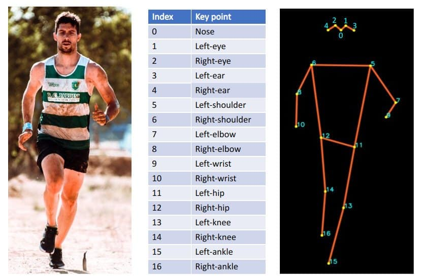

# Keypoint RCNN (for Human Pose Estimation)

The **Keypoint RCNN** model is based on the **Mask R-CNN** paper, and is publicly available in **PyTorch**.
In the Human Pose Estimation domain, Keypoint RCNN is among approaches that can estimate unique points on the human body, known as **KeyPoints**.
Human keypoints can contain **facial landmarks** (like nose-tip, face boundary) or **body joints** (like shoulders) in a person.

## 🧠 How Does it Work?

As Mask-RCNN is able to detect keypoints in the human body, with a slight modification in the architecture, a new solution for Keypoint Detection was proposed, named as **Keypoint RCNN**.
Keypoint RCNN slightly modifies the existing Mask RCNN, by one-hot encoding a keypoint (instead of the whole mask) of the detected object.
Note that in this case, the [MS-COCO](https://cocodataset.org/#home) dataset is used, which contains KeyPoints listed below:

## 💡 Applications

This system can be the foundation for computer vision-driven tasks, such as vision-based personal fitness training.
Possible applications are **determining the right body postures during exercise**, **push-up counter**, **facial expression detection**, or **Snapchat-like filters**.

## 🚀 Benchmark

You can find the benchmark results of **Keypoint RCNN** for Human Pose Estimation [here](keypoint-rcnn.ipynb).

## 📍 Links

- **🌐 Web-page**: [https://docs.pytorch.org/vision/main/models/keypoint_rcnn.html](PyTorch)
- **🔗 GitHub**: [https://github.com/bitsauce/Keypoint_RCNN](https://github.com/bitsauce/Keypoint_RCNN)
- **📄 Paper**: [https://doi.org/10.1109/ICCV.2017.322](https://doi.org/10.1109/ICCV.2017.322)