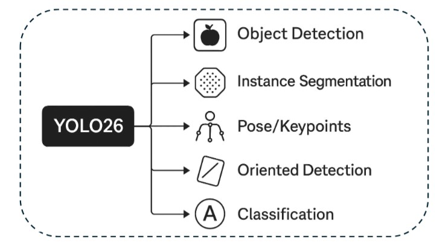

# YOLOv26 (Ultralytics)

**YOLO v.26** is a new You Only Look Once (YOLO) model introduced in January 2026, which is marginally lighter, faster, and more accurate than previous versions.
Compared to the previous versions, it removes components that complicate deployment and is optimized for CPU, GPU, and NPUs.
There is also another variant of YOLO, called **YOLOE-26**, that supports text and visual-prompted instance segmentation, enabling detection of open-vocabulary object detection.
According to the paper, **YOLOv26** performs up to 43% faster on CPUs compared to *YOLOv12*, providing sub-2ms latency for the Nano model on T4 GPUs.

## 🧠 How Does it Work?

**YOLO v.26** adds modifications by introducing transformer blocks, regression heads, and post-processing pipelines.
While traditional YOLO models depend on processes to remove duplicate bounding boxes (NMS), YOLOv26 introduces a One-to-One detection head, enabling the model to directly predict a fixed set of object hypotheses.
Additionally, it removes processes for improved bounding box precision (DFL) and replaces it with a simplified regression head, making it far easier to deploy on platforms like Jetson Orin and Raspberry Pi.

## 💡 Applications

It covers a wide range of applications in classic computer vision systems, mobile robotics, various devices, and embedded systems:

- Robotics application for deterministic latency enables smoother control loops
- Manufacturing applications for improved small-object detection for defect inspection
- Drones for lower compute and power requirements extend flight time
- Mobile & Embedded Vision applications for clean INT8/FP16 deployment without custom post-processing

## 🚀 Benchmark

You can find the benchmark results of **YOLO v.26** for object detection, semantic segmentation, and image classification [here](yolov26.ipynb). Also, another example for video-based object detection using **YOLO v.26** is available [here](yolov26_video.ipynb).

## 📍 Links

- **🌐 Source**: [https://learnopencv.com/yolov26-real-time-deployment/](LearnOpenCV)
- **🔗 GitHub**: [https://github.com/ultralytics/ultralytics](https://github.com/ultralytics/ultralytics)
- **📄 Paper**: [https://doi.org/10.48550/arXiv.2509.25164](https://doi.org/10.48550/arXiv.2509.25164)